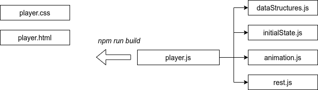
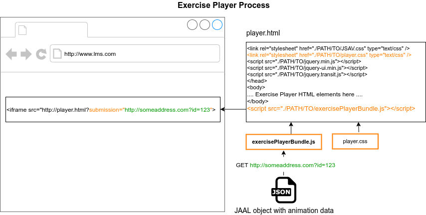

# JSAV Exercise Player

The JSAV Exercise Player is a JavaScript software for playing recordings of
Visual Algorithm Simulation exercises. It is based on
[JSAV](http://jsav.io) and [OpenDSA](https://github.com/OpenDSA/OpenDSA).
For extensive background information, see
[Giacomo Mariani's MSc thesis](https://aaltodoc.aalto.fi/handle/123456789/44448).

## Required software

To compile and run the software, you will need:

- [Node.js](https://nodejs.org/en/)
- [Browserify](http://browserify.org/)

## git branches

`master` is the main development branch.

`traky` is integration work for Data Structures and Algorithms Y (DSA Y) course.
This version of JSAV Exercise player does not handle communication with the
A+ LMS. The communication with the LMS is done in the function `n.showGrade()`
in the file
*tools/extras/OpenDSA/lib/odsaAV-min.js* at [DSA Y course repository]
(https://version.aalto.fi/gitlab/course/traky/blob/jaal/tools/extras/OpenDSA/lib/odsaAV-min-commented.js#L759).

When the Exercise Player bundle file is loaded into the HTML document, it
automatically looks for the URL parameter named *submission*, which should
contain the URL to be used by for fetching the animation data. The system
loading the Exercise Player has to provide the *submission* URL parameter when
loading the Exercise Player HTML file (player.html).

Since the Exercise Player uses certain HTML elements to construct the animation,
it is important that it is imported in the HTML document (player.html) after the
`<body>`element.

## Installation for development with DSA Y

It is assumed that the DSA Y course repository is at <some_dir>/traky.
Go to <some_dir> and give the following commands:

    git clone -b traky https://github.com/MarianiGiacomo/jsav-exercise-player
    cd jsav-exercise-player
    git submodule init && git submodule update
    npm install

For more information, see the file `exercises/jsav/jaal/README.md` in the
source code of [Data Structures and Algorithms
Y](https://version.aalto.fi/gitlab/course/traky). As of Autumn 2020, the
branch `2020-both` contains a working version.

## Running the tests
The tests are written with Jest. To run the tests do this the
`jsav-exercise-player` directory:

    npm run test

## Standalone player test

## Building the bundle file
To bundle all the required modules in one file use [Browserify](http://browserify.org/).

    npm install -g browserify
    ./build.sh

The DSA Y course repository, branch `traky`, should have a script called
`compile-jaal.sh` which does the rest.
